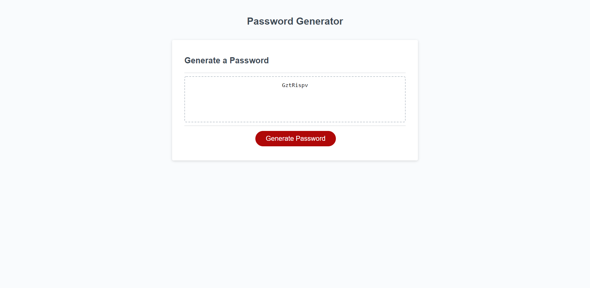

# Password Generator Starter Code

## Description
This password generator program was constructed using HTML, CSS, and JavaScript. It allows the user to select different conditions based on what they would like included on their password. These conditions are delivered through a pop on the browser. Some of the conditions must be met or it will ask the user consistently until the correct answer is provided. This program can be beneficial to anyone who is looking to update their password but is having a hard time coming up with a unique and secure passphrase. One issues that I struggled with while building this program was figuring out how to iterate through a list and how to refactor the code. In the future I hope to refactor the code more and give the user more choices to create an even safer password. It would also be great to add more aesthetic to the program.

Application link

https://georgedmendoza.github.io/password-generator/

## Usage 

Below is a screenshot of the website when a password is already generated.

